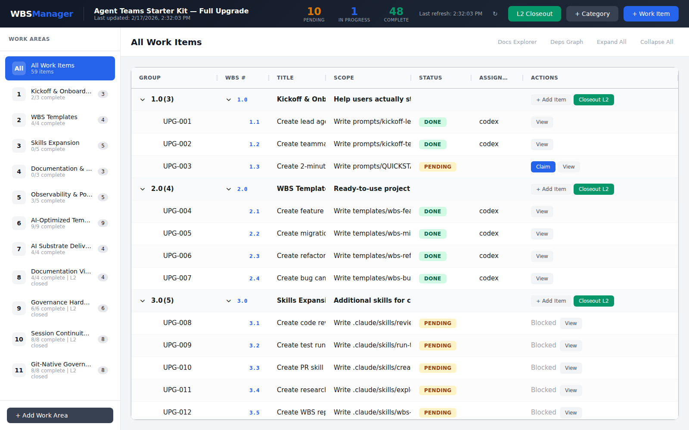

# Substrate

[](https://github.com/daviddfraser-source/Substrate/actions/workflows/test.yml)
[](#get-started)
[](https://codespaces.new/daviddfraser-source/Substrate)
[](LICENSE)

Formal packet/state-machine orchestration for multi-agent software delivery, with dependency gating, file-backed state, and auditable lifecycle logs.

Constitutional governance baseline: `constitution.md`.
Session bootstrap quick path: `START.md`.



## Why This Exists

Teams using agentic workflows need deterministic coordination mechanics when multiple actors touch the same work graph.

This project provides a technical control plane for common failure modes:
- work drift between planned and delivered outcomes
- race conditions during packet claiming/completion
- weak audit trails for ownership, transitions, and evidence

The approach is intentionally simple and inspectable:
- explicit packet lifecycle (`pending`, `in_progress`, `done`, `failed`, `blocked`)
- dependency graph gating before execution
- file-based state in `substrate/.governance/wbs-state.json`
- append-only activity log entries on lifecycle events
- atomic writes and lock-aware update flows

## Get Started

**Option A: GitHub Codespaces**
Open in Codespaces using the badge above, then run:

```bash
python3 start.py
```

**Option B: Local**

```bash
python3 start.py
```

Requirements: Python 3.8+.

### One-Command Bootstrap

```bash
./bootstrap.sh
# Windows PowerShell:
./bootstrap.ps1
```

Task shortcuts are also available via `Makefile`:

```bash
make bootstrap
make status
make ready
make root-hygiene
```

### New Project Initialization (3 Steps)

```bash
# 1) Bootstrap a clean scaffold (minimal profile recommended)
substrate/scripts/init-scaffold.sh substrate/templates/wbs-codex-minimal.json

# 2) Confirm first ready packet
python3 substrate/.governance/wbs_cli.py ready

# 3) Execute first packet lifecycle
python3 substrate/.governance/wbs_cli.py claim <PACKET_ID> <agent>
python3 substrate/.governance/wbs_cli.py done <PACKET_ID> <agent> "evidence summary" --risk none
python3 substrate/.governance/wbs_cli.py note <PACKET_ID> <agent> "Evidence: <paths>"
```

Re-initialize quickly during setup:

```bash
substrate/scripts/reset-scaffold.sh substrate/templates/wbs-codex-minimal.json
```

`init-scaffold.sh` installs the selected template into resident `substrate/.governance/wbs.json` before initialization.

> [!NOTE]
> This is a **Template Repository**. The intended workflow is to **Clone and Own**: once you instantiate this template, you own the entire codebase, including the governance tools in `substrate/src/governed_platform`. You are free to modify them, but be aware that deviating from the core logic may affect future updates or standard tooling compatibility.


## How It Works

### Packet Lifecycle

```text
PENDING --claim--> IN_PROGRESS --done--> DONE
                      |                   |
                    fail             unblocks
                      v             downstream
                   FAILED ---> BLOCKED
```

### Runtime Architecture

```mermaid
flowchart LR
  A[Packet Definition\nsubstrate/.governance/wbs.json] --> B[State Machine\n.wbs_cli.py]
  B --> C[State Store\nsubstrate/.governance/wbs-state.json]
  B --> D[Activity Log\nstate.log[]]
  B --> E[Dependency Gate]
  E --> B
  B --> F[Dashboard/API\nsubstrate/.governance/wbs_server.py]
  C --> F
```

Locking and write safety:
- packet transitions write via temp file + atomic replace
- state mutations use lock-aware flows where supported
- CLI remains source-of-truth for lifecycle transitions

### Project Structure (Where to put your code)

This template separates **governance tooling** from **user code**:

- `substrate/src/governed_platform/`: Contains the core Substrate logic (CLI, Server, State Machine). **Do not modify** unless you are upgrading the governance system itself.
- `substrate/src/app/`: **[YOUR CODE HERE]**. This is where your application logic, business rules, and agent implementations should reside.
- `substrate/tests/`: Add your application tests here.


## Commands

```bash
python3 substrate/.governance/wbs_cli.py ready
python3 substrate/.governance/wbs_cli.py claim IMP-001 codex-lead
python3 substrate/.governance/wbs_cli.py done IMP-001 codex-lead "Implemented and tested" --risk none
python3 substrate/.governance/wbs_cli.py note IMP-001 codex-lead "Evidence: substrate/docs/path.md"
python3 substrate/.governance/wbs_cli.py risk-list --status open
python3 substrate/.governance/wbs_cli.py break-fix-list --status open
python3 substrate/.governance/wbs_cli.py prd --output substrate/docs/prd/my-feature-prd.md
python3 substrate/.governance/wbs_cli.py delivery-report 7.0
python3 substrate/.governance/wbs_cli.py status
```

## Agent Support

This governance framework supports both programmatic native execution (via MCP) and legacy terminal CLI execution.

### The MCP Server (Recommended)
For modern Agentic IDEs (VS Code + Antigravity, Cursor, Cline), use the native **Model Context Protocol (MCP)** server included at `substrate/.governance/mcp_server.py`. 
The server exposes `claim_packet`, `mark_packet_done` and others as native tool calls, drastically simplifying agent configuration.

### Agent Docs Matrix

| Agent | Primary Doc | Startup Pattern |
|---|---|---|
| Claude Code | `CLAUDE.md` | Uses `substrate/scripts/cc-*` wrappers or governance CLI |
| Gemini | `GEMINI.md` | Uses MCP Server (via ambient state) or governance CLI |
| Codex | `codex.md` | Uses governance CLI directly |

### Claude Code

Claude reads `CLAUDE.md` at project open.

```bash
substrate/scripts/cc-ready
substrate/scripts/cc-claim <PACKET_ID>
substrate/scripts/cc-done <PACKET_ID> "evidence"
substrate/scripts/cc-status
```

Guide: `substrate/docs/claude-code-guide.md`

### Gemini

Gemini reads `GEMINI.md` at project open.

```bash
substrate/scripts/gc-ready
substrate/scripts/gc-claim <PACKET_ID>
substrate/scripts/gc-done <PACKET_ID> "evidence"
substrate/scripts/gc-status
```

### Codex

Codex reads `codex.md` at project open.
Codex-first operator assets are in `.codex/`.

Use the same governance CLI directly:

```bash
python3 substrate/.governance/wbs_cli.py ready
python3 substrate/.governance/wbs_cli.py claim <PACKET_ID> codex-lead
```

Cross-agent references: `CLAUDE.md`, `GEMINI.md`

### Human Operators

```bash
python3 start.py
```

### Other LLM Agents

Any agent that can execute shell commands can use:

```bash
python3 substrate/.governance/wbs_cli.py <command>
```

## Project Policies

- Contribution guide: `substrate/docs/project/CONTRIBUTING.md`
- Security policy: `substrate/docs/project/SECURITY.md`
- Product-owner workflow: `substrate/docs/product-owner-mode.md`
- E2E viewer workflow: `substrate/docs/e2e-viewer-workflow.md`
- Break-fix workflow: `substrate/docs/break-fix-workflow.md`

## Skills

| Skill | Technical Purpose |
|---|---|
| [`substrate/skills/agent-eval`](substrate/skills/agent-eval) | Prompt/eval harness integration for regression checks |
| [`substrate/skills/security-gates`](substrate/skills/security-gates) | Static/security scanning gate patterns |
| [`substrate/skills/pr-review-automation`](substrate/skills/pr-review-automation) | Automated reviewdog-style PR review workflows |
| [`substrate/skills/precommit-governance`](substrate/skills/precommit-governance) | Pre-commit governance and repository checks |
| [`substrate/skills/ui-regression`](substrate/skills/ui-regression) | Playwright critical-path UI regression workflow |
| [`substrate/skills/observability-baseline`](substrate/skills/observability-baseline) | Baseline telemetry and trace pipeline setup |
| [`substrate/skills/skill-authoring`](substrate/skills/skill-authoring) | Scaffold and lint custom skill packages |
| [`substrate/skills/mcp-catalog-curation`](substrate/skills/mcp-catalog-curation) | Evaluate and curate MCP/tool catalog entries |

## Clone Profiles

Use clone profiles to strip optional tooling after clone:

```bash
substrate/scripts/clone-profile.sh list
substrate/scripts/clone-profile.sh preview codex-only
substrate/scripts/clone-profile.sh apply codex-only --yes
```

Quick cleanup command:

```bash
substrate/scripts/post-clone-cleanup.sh --profile codex-only --yes
```

## Templates

| Template | Use Case |
|---|---|
| `substrate/.governance/wbs.json` | Default clean baseline scaffold for clone-and-own projects |
| `substrate/templates/wbs-codex-minimal.json` | Fast Codex scaffold bootstrap |
| `substrate/templates/wbs-codex-full.json` | Full scaffold/governance setup |
| `substrate/templates/wbs-codex-refactor.json` | Legacy migration profile compatibility |

```bash
substrate/scripts/init-scaffold.sh
# or explicitly:
substrate/scripts/init-scaffold.sh substrate/templates/wbs-codex-minimal.json
substrate/scripts/reset-scaffold.sh
python3 substrate/.governance/wbs_cli.py template-validate
```

See `substrate/docs/template-usage.md` for scaffold onboarding flow.

Internal Substrate upgrade roadmap packets are archived in:
`substrate/docs/codex-migration/packets/substrate-internal-upgrade-roadmap-wbs-2026-02-17.json`.

## Scaffold vs Runtime Artifacts

Scaffold artifacts (safe to ship/commit):
- `substrate/.governance/wbs.json` (baseline packet definition)
- `substrate/templates/*.json` (profile definitions)
- `substrate/scripts/init-scaffold.sh`, `substrate/scripts/reset-scaffold.sh`, `substrate/scripts/scaffold-check.sh`
- `substrate/docs/*`, `substrate/prompts/*`, `substrate/skills/*`, `substrate/src/*`

Runtime artifacts (generated during execution; do not ship):
- `substrate/.governance/wbs-state.json`
- `substrate/.governance/activity-log.jsonl` (legacy runtime log if present)
- `substrate/.governance/residual-risk-register.json`

Publishing hygiene:
- Run `python3 substrate/.governance/wbs_cli.py template-validate` before release.
- Run `./substrate/scripts/check-root-hygiene.sh` before release.
- Build git-ready snapshot with `./substrate/scripts/publish-git-ready.sh <snapshot-name>` (excludes generated template artifacts).

## Troubleshooting

- `Packet viewer API unavailable (HTTP 404)`
  - You are likely on the wrong server/port or an outdated server process.
  - Start dashboard from repo root with `python3 start.py --dashboard --port 8090` or `python3 substrate/.governance/wbs_server.py 8090`.

- `Failed to execute 'json' on 'Response'` / `Unexpected end of JSON input`
  - API route returned non-JSON (often from stale server route handling).
  - Restart dashboard server and retry on the correct port.

- `Not initialized. Run: python3 substrate/.governance/wbs_cli.py init substrate/.governance/wbs.json`
  - Initialize state file before dashboard/CLI lifecycle commands.

- Dependency not met when claiming a packet
  - Run `python3 substrate/.governance/wbs_cli.py ready` and complete upstream dependencies first.

- State file appears inconsistent after interruption
  - Re-open status with `python3 substrate/.governance/wbs_cli.py status`.
  - Re-run `python3 substrate/.governance/wbs_cli.py validate` and inspect `substrate/.governance/wbs-state.json` + recent log entries.

## Architecture Notes

Additional architecture rationale is in `substrate/docs/architecture.md`.
Residual risk lifecycle guidance is in `substrate/docs/codex-migration/residual-risk-governance.md`.

## Testing

```bash
python3 -m unittest discover -s substrate/tests -v
```

## License

MIT.
